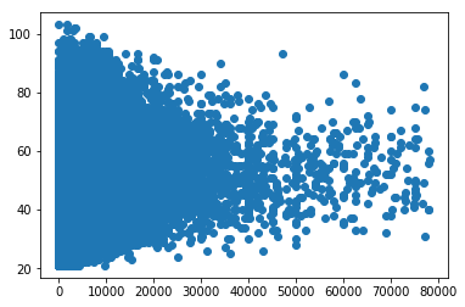

# Give Me Some Credit

## Index
1. [Introduction](#1-introduction)
2. [Data Preprocessing](#2-data-preprocessing)
3. [Model Building & Grid Search](#3-model-building--grid-search)
4. [Handling Undersampling](#4-handling-undersampling)
5. [Conclusion](#5-conclusion)

## 1. Introduction

Nowadays, banks influence investment decisions by granting or withholding loans to individuals and businesses. The main criterion for making these decisions is credit scoring systems. This project's mission is to refine the credit scoring mechanism, thereby empowering borrowers to make informed financial choices.

## 2. Data Preprocessing

### Handling Missing Values

Two attributes exhibited missing values:
- **MonthlyIncome**: Missing 18.82%
- **NumberOfDependents**: Missing 2.62%

#### Approach:
- For `NumberOfDependents`, the median was employed to replace missing values.
  
- Addressing `MonthlyIncome` was more involved:

  - A detailed analysis highlighted distinct income brackets among different age groups. Specifically, individuals aged between 25 to 70 had a noticeable proportion earning above 30,000, while others predominantly fell within the 0 to 25,000 range.
  - Considering this segmentation based on age, a RandomForestRegressor model was utilized to impute the missing income values, ensuring a more accurate and relevant fill.

### Checking Data Correlation

Correlation heatmaps were employed to ascertain the relationships between different attributes. Attributes with extremely high correlations, like 0.99 and 0.98, were identified and eliminated to reduce multicollinearity and ensure model reliability.

## 3. Model Building & Grid Search

Four predictive models were evaluated:
- Logistic Regression
- Decision Tree
- Random Forest
- K-Neighbors

In the initial iterations, the Random Forest model showcased a commendable ROC AUC of over 0.85. However, this success did not translate seamlessly to the Kaggle test dataset, which yielded a score of 0.498.

## 4. Handling Undersampling

The class distribution of the target variable revealed a pronounced imbalance: 
- Class 0 (No delinquency): 93%
- Class 1 (Experienced 90 days past due delinquency): 6.6%

Such imbalance led to the models displaying an inherent bias towards the majority class.

#### Approach:

To rectify this, under-sampling techniques were adopted to balance the class distribution, striving for a 50:50 ratio. After implementing these adjustments, model performance notably improved, resulting in a Kaggle ROC_AUC score of 0.82638.

## 5. Conclusion

The domain of credit scoring stands to gain significantly from advanced machine learning methodologies. While substantial improvements in predictive accuracy were achieved in this project by addressing data quirks and class imbalances, there is always scope for refining techniques to enhance the robustness and reliability of credit scoring models.

