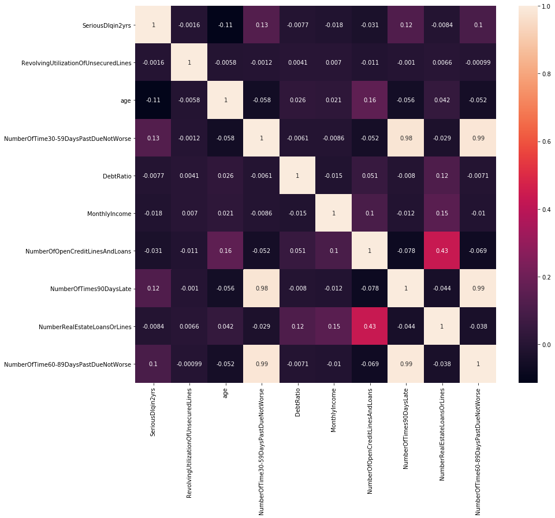

# Give Me Some Credit

## Index
1. [Introduction](#1-introduction)
2. [Data Preprocessing](#2-data-preprocessing)
3. [Model Building & Grid Search](#3-model-building--grid-search)
4. [Handling Undersampling](#4-handling-undersampling)
5. [Conclusion](#5-conclusion)

## 1. Introduction

Nowadays, banks influence investment decisions by granting or withholding loans to individuals and businesses. The main criterion for making these decisions is credit scoring systems. This project's mission is to refine the credit scoring mechanism, thereby empowering borrowers to make informed financial choices.

## 2. Data Preprocessing

### Handling Missing Values

Two attributes exhibited missing values:
- **MonthlyIncome**: Missing 18.82%
- **NumberOfDependents**: Missing 2.62%

#### Approach:
- For `NumberOfDependents`, the median was employed to replace missing values.
  
- Addressing `MonthlyIncome` was more involved:

  - The plot highlighted distinct income brackets among different age groups. Specifically, individuals aged between 25 to 70 had a noticeable proportion earning above 30,000, while others predominantly fell within the 0 to 25,000 range.
  - Considering this segmentation based on age, a **RandomForestRegressor** model was utilized to impute the missing income values, ensuring a more accurate and relevant fill.

### Checking Data Correlation

Correlation heatmaps were employed to ascertain the relationships between different attributes. Attributes with extremely high correlations, like 0.99 and 0.98, were identified and eliminated to reduce multicollinearity and ensure model reliability.

## 3. Model Building & Grid Search
Several models were employed to find the best classifier for the credit scoring system. The models used were:

- Logistic Regression
- Decision Tree Classifier
- Random Forest Classifier
- K-Neighbors Classifier

To optimize the models, a combination of a pipeline and grid search was implemented. The pipeline streamlined the process of scaling the features and applying the model. Meanwhile, the grid search was pivotal in tuning the hyperparameters for each model based on the roc_auc score. The models' parameters varied; for instance, the `RandomForestClassifier` considered various numbers of estimators, depth levels, and feature counts.

Post initial model training, while the Random Forest model showcased a commendable ROC_AUC of over 0.85 on validation data, the performance on Kaggle's test set was found lacking with a score of only 0.498. This disparity hinted at potential issues within the training data itself, prompting a deeper dive into the dataset's characteristics.

## 4. Handling Undersampling

A critical observation was the significant class imbalance in the dataset.: 
- Class 0 (No delinquency): 93%
- Class 1 (Experienced 90 days past due delinquency): 6.6%

Such an imbalance invariably led to models heavily favoring the majority class, skewing predictions.

#### Approach:

To remediate this imbalance, the RandomUnderSampler method was employed, ensuring a balanced class distribution in the training data. The resultant dataset was transformed from its original format to a balanced 50:50 distribution between the classes.

Following the balancing act and retraining the models on this equitably distributed dataset, there was a marked improvement in performance. The Random Forest model, post adjustments, achieved a Kaggle ROC_AUC score of 0.82638.

## 5. Conclusion

This project highlighted the importance of understanding the data's nature and challenges it might pose. While advanced models and hyperparameter tuning play a role, sometimes addressing fundamental data issues, like class imbalance, can make all the difference. The success in handling undersampling was pivotal, turning the project's trajectory from a potential misclassification disaster to an insightful solution to the credit scoring problem.

